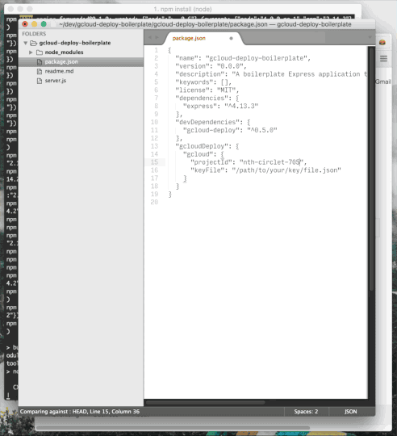

# [gcloud-deploy](http://gitnpm.com/gcloud-deploy) Boilerplate
> A boilerplate [Express](http://gitnpm.com/express) application that can be deployed to [Google Compute Engine](https://cloud.google.com/compute/docs)

```bash
$ git clone git@github.com:stephenplusplus/gcloud-deploy-sample-app
$ cd gcloud-deploy-sample-app
$ npm install
```



See the [Prerequisites](https://github.com/stephenplusplus/gcloud-deploy#prerequisites) section of the gcloud-deploy documention for how to get started.

Once you are ready to deploy, edit the `gcloudDeploy` object in the `package.json` file with your projectId and the path to your key file.

```bash
$ npm run deploy
```

Then, monitor the output to see the server initialize. Each output line should follow the format of:

```bash
[TIMESTAMP] ([SERVER IP]): [LOG]
```

If all goes well, the output will take a long break. It should look something like this:

```bash
2015-10-19T15:43:01.834586+00:00 (http://104.197.215.90): > gcloud-deploy-sample-app@0.0.0 start /opt/app
2015-10-19T15:43:01.834705+00:00 (http://104.197.215.90): > node server.js
```

At this point, visit the IP address in parentheses to see your app running. Keep your terminal open to see the log output continue.
